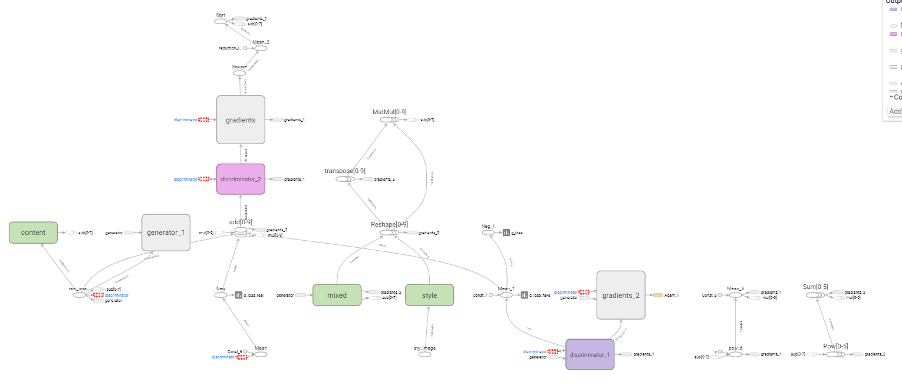
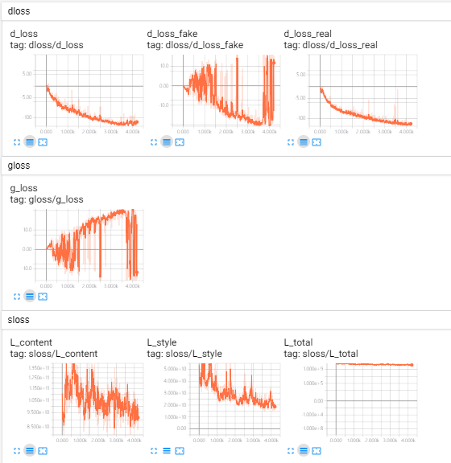

## Fast-Style Transfer GAN

A tensorflow implementation of fast-style transfer GAN  which is proposed by meself. This idea is composed of style transfer, fast style transfer and the GAN.


## Usage

### Prerequisites

1. Tensorflow
2. Python packages: numpy, scipy, PIL(or Pillow), matplotlib
3. Pretrained VGG19 file: [imagenet-vgg-verydeep-19.mat](http://www.vlfeat.org/matconvnet/models/imagenet-vgg-verydeep-19.mat)

### Running

```python
python main.py  --folder_path <dataset path>  --style_image <style file>       --vgg_path <vgg path>
```

##### Arguments

Required:

* --folder_path: The directory of your own data_path, you need to pay attetnion to the numer of your dataset. It must can be mod by the batch size.
* --style: The directory of your style image
* --vgg_path: The directory of your downloaded pretrained vgg model

Optional:

* You can get all the explanation in the code

##### Model Graph



### Training visualization

```python
tensorboard --logdir="log_path"
```




## Acknowledgements

This implementation has been tested with Tensorflow 1.12.0 on Windows 10.